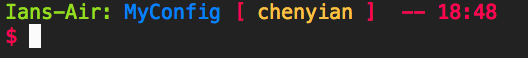
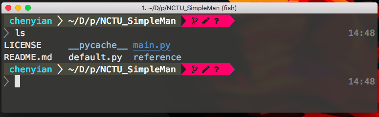

# MyConfig

##### Bash prompt


##### Fish prompt


My unix configuration file, with auto-setup script inside

## Installation
```sh
git clone https://github.com/ianre657/MyConfig.git ~/MyConfig
cd ~/Myconfig
python3.6 -m autosetup install
```

## Config outline

#### Vim

1. Plugin Manager : [`vim-plug`](https://github.com/junegunn/vim-plug)

###### key mapping
1. use `space` as `leader key`
2. type `jk` in insert mode is equal to `<ESC>`
 + casual keymapping
    + `<leader> - w` : change window
    + `<leader> - n` : Next opened file
    + `<leader> - p` : Previous opended file
 + plugins 
    + `<leader> - t` : toggle `Nerd tree`
    + `<leader> - e` : toggle `Buf explorer`
    + `<leader> - g` : toggle `Goyo`(zen mode) 
    + `F4`: toggle `tagbar`


## further Maunal configs
1. build `vim` with `lua` support in order to use vim plugin : [`Shougo/neocomplete`](https://github.com/Shougo/neocomplete.vim) 

## trouble shooting

### why my font doesn't shows up

You should consider installing either `[powerline font](https://github.com/powerline/fonts)` or `[nerd fonts](https://github.com/ryanoasis/nerd-fonts)`.
and after that, change the corresponding line in `~/.config/fish/config.fish`
```fish
# set these 2 lines accroading to your font type
set -g theme_nerd_fonts yes 
set -g theme_powerline_fonts no
```

## For mac user
Droid sans mono nerd font is my favorite font
`brew cask font-droidsansmono-nerd-font`
